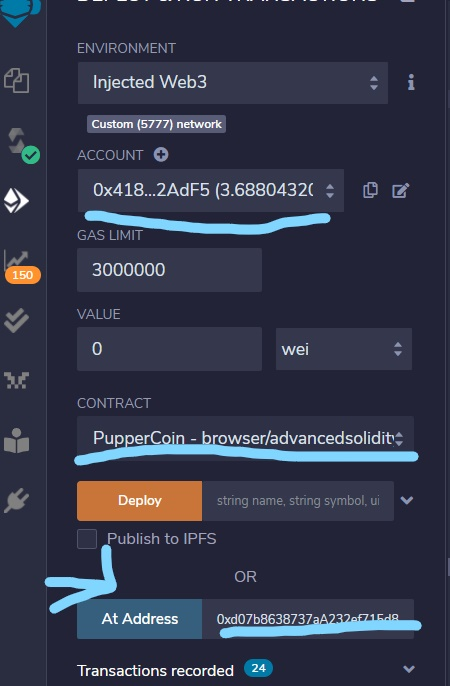

## Crowdsale
We will be deploying a crowdsale contract to raise funds for the Pupper Coin Token.

* First we deploy the Pupper Token Deployer contract that has the Puppercoinsale  contract and the Puppercoin minting contract: 

Entering the tokens name, symbol and the wallet that you would like to raise the funds and then hitting transact to deplor the contract deployer.

* Next you deploy the sale contract as shown below:

Using the Toke_sale_address button in the deployer contract you copy and past that address in the At Address field above. Then you switch the contract to the PupperCoinSale contract and hit At Address to deploy the Sale contract.

* Next you deploy the puppercoin contract that would allow you to mint the tokens. Using the token function in the sale contract copy the address and paste it in the At Address field. Also changing the contract above to Puppercoin just like we did when deploying the Sale contract before. Shown below:

# Raising the funds

After the contracts are deployed anybody with a wallet and ethereum can then go and buy tokens. After reaching your goal of money to be raised you can finalize the contract once the time is up (the time that you set as closing time). 

* Here is how you buy the tokens (make sure you use a seperate address from the one that you are raising the funds with, that luanched the contracts):

* As before, after the time has passed nobody will be able to buy anymore tokens and you can finalize the contract:

* Once the contract is finalized you can release the tokens to the beneficiaries that helped you fund raise: 

* Finally to add the tokens to your wallet, you'll need to go into Metamask for example, go into add tokens and custom tokens. You'll paste the token_address that is the first function of the deployer contract. The rest should autofill and you can add the token to your wallet:

## Congratulations!! You should see your tokens in your wallet!

Deploying the contract onto the kovan network is similiar but make sure to switch to the kovan network on metamask and that it shows on Remix as well. Also make sure that you have enough funds (using faucets) to fund the deployments of the contracts:

## Thats all! Thank you for reading! 

